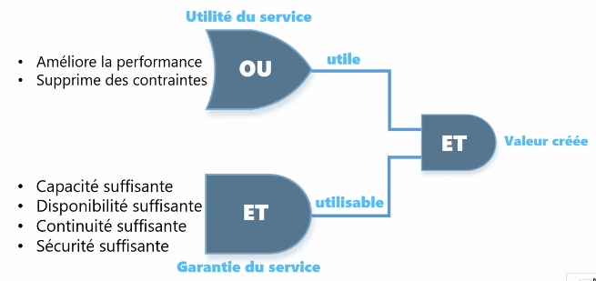

# Introduction à ITIL
---
## C'est quoi ?

### Selon [Wikipédia](https://fr.wikipedia.org/wiki/Information_Technology_Infrastructure_Library): 
> ITIL (pour « Information Technology Infrastructure Library », ou « Bibliothèque pour l'infrastructure des technologies de l'information » en français) est un ensemble d'ouvrages recensant les bonnes pratiques (« best practices ») du management du système d'information.
> C'est un référentiel méthodologique très large qui aborde les sujets suivants :
> - Comment organiser un système d'information ?
> - Comment améliorer l'efficacité du système d'information ?
> - Comment réduire les risques ?
> - Comment augmenter la qualité des services informatiques ?

### Selon [DNSStuff](https://www.dnsstuff.com/fr/qu-est-ce-que-itil):
> Il s’agit d’une structure de pratiques conseillées qui aide à dispenser des services informatiques de qualité. L’approche ITIL vise à combiner des processus, des individus et des technologies pour faciliter la prestation de services, l’évolution et la maintenance pour les utilisateurs finaux ou les clients.

## À quoi ça sert ?
ITIL v3 propose une évolution de la gestion de projet vers la gestion de service qui est orientée client 
- **Un projet**
    - C'est la capacité à implémenter de nouvelles fonctionnalités par rapport à:
        - De nouveaux besoins
        - Une nouvelle législation
        - Une avancée technologique

- **Un service**
    - C'est l'ensemble des moyens mis en oeuvre pour apporter à un client de la valeur sans qu'il n'en supporte ni les coûts ni les risques
    - C'est une application installé sur une infrastructure avec:
        - Une documentation associée 
        - Une formation adaptée 
        - Un support mis en place
        - De l'assistance aux utilisateurs
    - C'est la capacité à produire le service demandé en respectant trois critères importants:
        - Aligner les services informtiques sur les besoins des clients 
        - Améliorer la qualité des services informatiques
        - Maîtriser les coûts de fourniture
    - C'est aussi un engagement sur le résultat:
        - Vis à vis du client 
        - Face au risque 

Un service doit créer de la valeur, 2 conditions permettent ceci:
1. Utilité (dimension de la prestation)
    - La raison d'être d'un service 
        - Amélioration des performances
        - Dépassement des contraintes
        - Ou les deux 
2. Garantie (utilisabilité)
    - La garantie est l'assurance, pour le client, que le service va remplir les exigences de niveau de qualité contractualisé (condition, résultats, lieu, délais et moment)
    - C'estle niveau d'usage dontle client et ses utilisateurs ont besoin 
    - Elle doit respecter:
        - Les heures d'ouverture
        - La disponibilité
        - La performance 
        - La continuité de service 
        - La sécurité

Voici un exemple imagé:

## Modèle R.A.C.I.

1. **R**esponsible (réalise et reporte - chargé de faire)
    - En charge de la réalisation de l'action 
    - Sous-traitant de A 
    - Au moins 1 par action 

2. **A**ccountable (autorise et assume - responsable)
    - Rend des comptes sur l'avancement de l'action 
    - Assume la responsabilité de l'action 
    - 1 seul par action 

3. **C**onsulted (est consulté)
    - Impliqué dans l'action en tant que fournisseur d'avis 
    - L'avis doit être pris en compte par la persionne qui l'a demandé 
    - Au moins 1 par action

4. **I**nformed (est informé)
    - Doit prendre connaissance de l'action et de son avancement 
    - Doit être informé sur le déroulement, le résultat 
    - Au moins 1 par action
